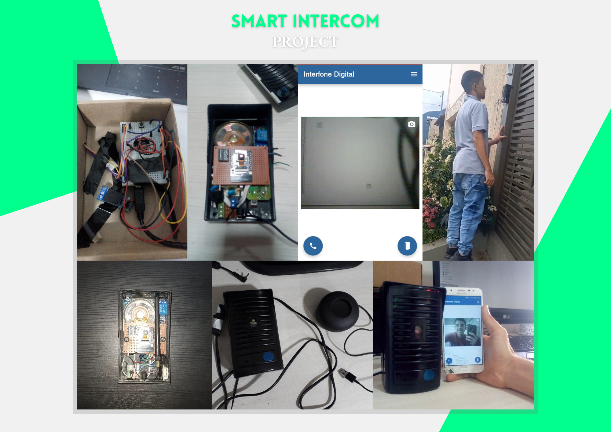

# IntercomVideo
Code for the Esp32-Cam board, which is responsible for the video and door opening section of the Smart Intercom.

    

## Video
You can check the video of the project explanation in the [link](https://bit.ly/smart-intercom).